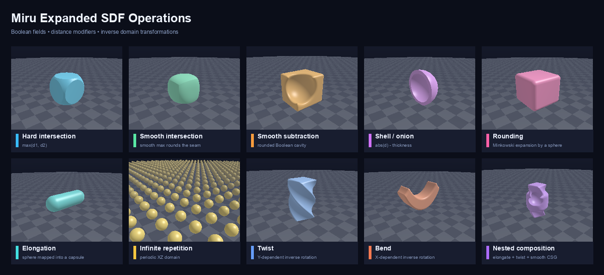

# miru
Rendering experiments (Python, CPP)

## Rendering experiments using Python

Simple raytracing, to run you should type:
```bash
python simpleraytracing/test.py
```


## Rendering experiments using CPP

### Dependencies

On MacOS install:

```bash
brew install png++
```


## Planned features

## Composable signed distance fields

The Python ray-marching package includes exact primitives, Boolean operations,
distance modifiers, and coordinate-domain transformations:

- sphere, box, plane, and torus primitives;
- union, intersection, subtraction, and smooth variants;
- shell/onion and rounding modifiers;
- elongation, infinite repetition, twisting, and bending;
- central-difference normals shared by primitive and composed fields.

Boolean and distance-modifier operations preserve a direct relationship with
the underlying signed distances. Non-rigid domain transformations such as
twisting and bending generally produce conservative distance estimators rather
than mathematically exact SDFs, so renderers should use a safety factor while
sphere tracing them.

Run the tests:

```bash
PYTHONPATH=src/python python3 -m unittest discover -s src/python/tests -v
```

Render ten examples and their comparison gallery:

```bash
PYTHONPATH=src/python python3 \
  src/python/examples/render_sdf_operations_gallery.py \
  examples/sdf_operations
```




## Contributing

Feel free to submit PRs. I will do my best to review and merge them if I consider them essential.

## Development status

This is a very alpha software. The code was written with no consideration of coding standards and architecture. A refactoring would do it good...

## See also
